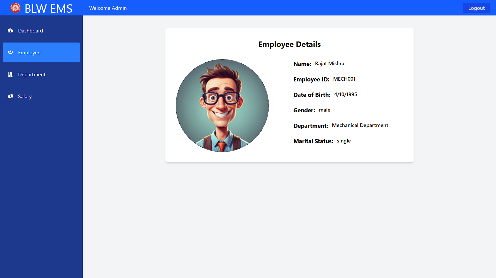

---

# BLW EMS - Banaras Locomotive Works Employee Management System

**BLW EMS** is a web-based Employee Management System designed for **Banaras Locomotive Works (BLW)**, aimed at managing employee details, departments, and salary information efficiently. This project was developed as part of an internship at **BLW, Varanasi** under the EDP (Electronic Data Processing) department.

> ⚠️ **Note:** The project is partially completed. Currently, only the **Admin panel** is functional. User login and employee dashboard features are yet to be developed. Contributions are welcome!

---

## Features (Implemented)

### Admin Panel

The admin panel allows managing employees, departments, and salaries.

**Dashboard**

* Overview of total employees, departments, and monthly salary
* Leave details including applied, approved, pending, and rejected leaves

**Employee Management**

* Search employees by department
* Add new employee
* View and edit employee details
* View employee salary details

**Department Management**

* Search departments by name
* Add new department
* Edit and delete existing departments

**Salary Management**

* Add salary details for employees
* Fields included: Department, Employee, Basic Salary, Allowances, Deductions, Pay Date

---

## Pending Features

* User login (employee login)
* Employee dashboard

> Contributions are welcome to help complete these features.

---

## Technology Stack

* **Frontend:** HTML, CSS, JavaScript
* **Backend:** Node.js
* **Database:** MySQL

---

## Screenshots

### Login Page


### Dashboard


### Employee Management





### Department Management


### Salary Management


---

## How to Run

1. Clone this repository:

   ```bash
   git clone https://github.com/yourusername/blw-ems.git
   ```

2. Import the database (`BLW_EMS.sql`) into MySQL.

3. Update database configuration in the backend.

4. Run the project on a local server (e.g., XAMPP/WAMP).

5. Access the admin panel using credentials:

   ```text
   Admin Username: admin
   Admin Password: admin123
   ```

---

## Contributing

We welcome contributions to enhance this project:

* Implement user login and employee dashboard
* Enhance UI/UX of the admin panel
* Add additional reports or analytics

**Steps to contribute:**

1. Fork the repository
2. Create a feature branch (`git checkout -b feature-name`)
3. Commit your changes (`git commit -m 'Add some feature'`)
4. Push to the branch (`git push origin feature-name`)
5. Create a Pull Request

---

## License

This project is licensed under the **MIT License**.

---

## Contact

**Intern:** Malay Vishwakarma
**Institution:** Ashoka Institute of Technology and Management, B.Tech CSE 3rd Year
**Certificate:** Internship at Banaras Locomotive Works, Varanasi

---


